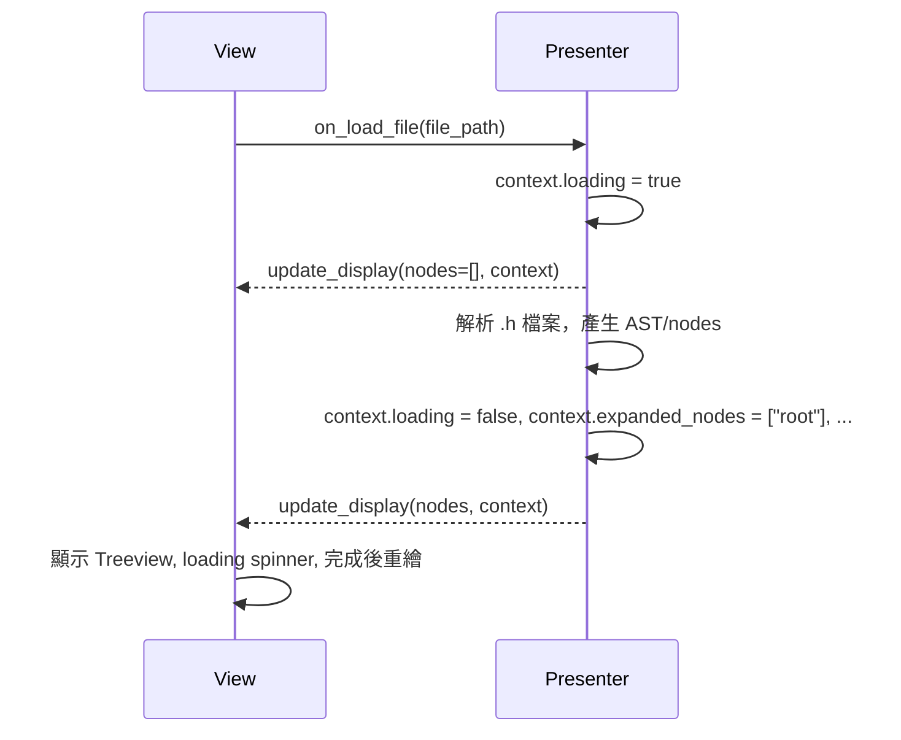
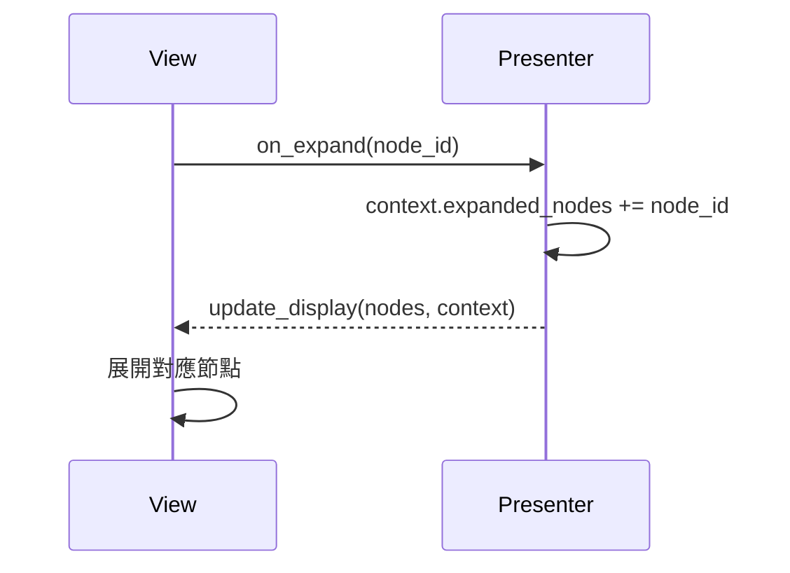
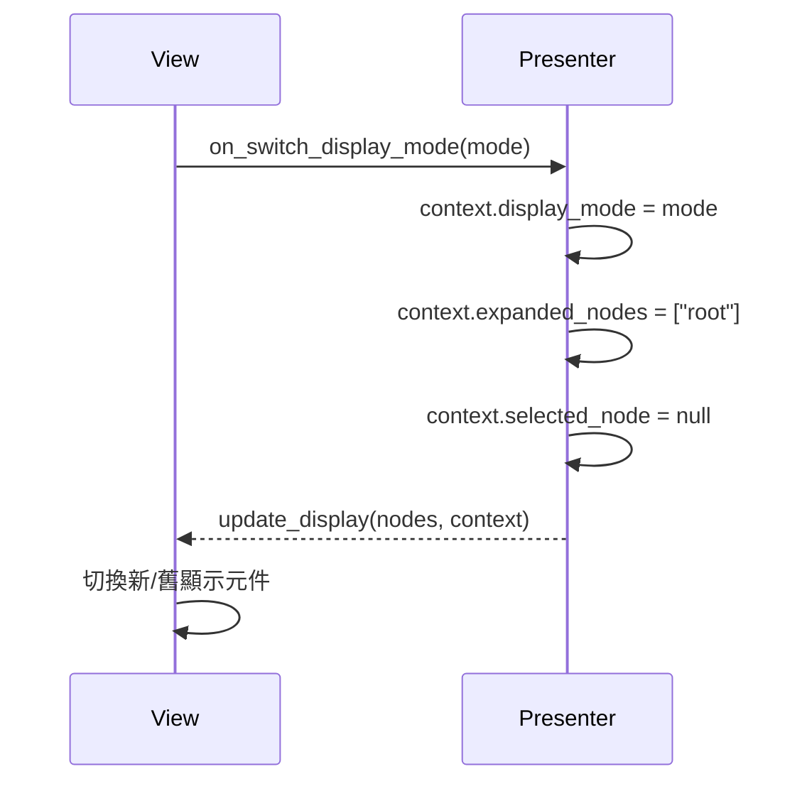
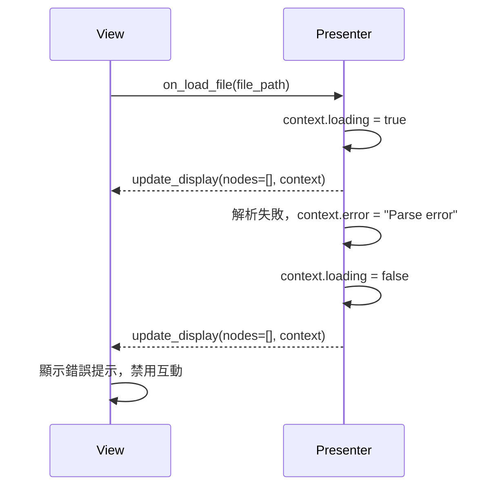

# v6 GUI V2P API（View <-> Presenter 溝通協議）

## 1. 資料結構定義
### 1.1 AST Node
- id: str
- name: str
- type: str  // 基本型別、struct、union、array、bitfield
- children: List[AST Node]
- is_struct: bool
- is_union: bool
- value: Any
- offset: int
- size: int
- bitfield info: dict（如 bit_size, bit_offset, is_bitfield）

### 1.2 Treeview Node
- id: str
- label: str
- type: str
- children: List[Treeview Node]
- icon: str（可選）
- extra: dict（如顏色、展開狀態等）

### 1.3 事件 Payload
- node_id: str
- mode: str（tree/flat）
- value: Any
- ...

---

## 2. Presenter 對外 API
### 2.1 取得資料
- get_struct_ast() -> AST Node
- get_display_nodes(mode: str) -> List[Treeview Node]

### 2.2 狀態/模式切換
- on_switch_display_mode(mode: str)

### 2.3 事件處理
- on_node_expand(node_id: str)
- on_node_click(node_id: str)

### 2.4 資料查詢
- get_member_value(node_id: str) -> Any

---

## 3. View 觸發事件
### 3.1 節點點擊
- on_node_click(node_id: str)

### 3.2 顯示模式切換
- on_switch_display_mode(mode: str)

### 3.3 其他互動
- on_refresh()
- on_expand(node_id: str)
- on_collapse(node_id: str)

---

## 4. 狀態同步與資料流
- Presenter 維護 context，View 只負責顯示與事件。
- 切換新舊顯示、展開/收合、資料更新時，Presenter 主動推送狀態給 View。
- View 觸發事件時，僅傳遞必要參數給 Presenter。

---

## 5. Mock 資料與範例
### 5.1 AST Node 範例
```python
{
  "id": "root",
  "name": "V5Example",
  "type": "struct",
  "children": [
    {"id": "nested", "name": "nested", "type": "struct", "children": [...]},
    {"id": "arr2d", "name": "arr2d", "type": "int[2][3]", "children": [...]},
    {"id": "u", "name": "u", "type": "union", "children": [...]},
    {"id": "tail", "name": "tail", "type": "char", "children": []}
  ],
  "is_struct": true,
  "is_union": false,
  "offset": 0,
  "size": 32
}
```

### 5.2 Treeview Node 範例
```python
{
  "id": "nested",
  "label": "nested [struct]",
  "type": "struct",
  "children": [
    {"id": "nested.x", "label": "x: int", "type": "int", "children": []},
    {"id": "nested.y", "label": "y: char", "type": "char", "children": []},
    ...
  ],
  "icon": "struct",
  "extra": {"color": "blue"}
}
```

---

## 6. 版本控管與變更紀錄
- v1.0 初版 API 設計
- ... 

---

## 7. API 資料流設計建議（長期開發穩定性）

### 7.1 單一資料來源（Single Source of Truth）
- Presenter 維護所有狀態（AST、顯示模式、展開狀態、選取節點、欄位值等）。
- View 只負責顯示與事件回報，不直接維護資料狀態。

### 7.2 明確的資料流向
- 資料下行（Presenter → View）：Presenter 主動推送 AST、Treeview node、狀態資訊給 View。
- 事件上行（View → Presenter）：View 只回報用戶操作（如點擊、展開、切換模式），不直接操作資料。

### 7.3 事件驅動、狀態推送
- View 觸發事件（如 on_node_click），Presenter 處理後主動推送最新狀態給 View。
- 支援 callback、observer、event bus 等模式，確保狀態一致。

### 7.4 資料結構穩定、可擴充
- AST node、Treeview node 結構要有 version/extra 欄位，方便未來擴充。
- 事件 payload 統一格式，便於測試與 mock。

### 7.5 Presenter context 設計
- Presenter 維護一份 context dict，包含：
  - display_mode（tree/flat/old/new）
  - expanded_nodes（展開節點 id 列表）
  - selected_node（目前選取節點 id）
  - 其他狀態（如 filter、search、error）

### 7.6 資料流範例
1. 載入 .h 檔案
   - View 請求 Presenter 載入
   - Presenter 解析 AST，推送 update_display(nodes, context) 給 View
2. 用戶展開節點
   - View 呼叫 on_expand(node_id)
   - Presenter 更新 context，推送新 nodes/context 給 View
3. 切換新舊顯示模式
   - View 呼叫 on_switch_display_mode(mode)
   - Presenter 更新 context，推送新 nodes/context 給 View

### 7.7 長期開發穩定性與擴充性建議
- 所有資料與狀態都由 Presenter 控制，View 只負責顯示與事件回報。
- API 文件要有 version/extra 欄位，方便未來擴充。
- 事件與資料結構要有單元測試與 mock，確保每次 refactor 不破壞協議。
- Presenter context 設計要能支援多種顯示模式、狀態同步、回退機制。
- View 可根據 context 決定顯示哪些元件、如何切換新舊顯示。

### 7.8 結論
- API 資料流設計建議：Presenter 維護所有狀態，View 只負責顯示與事件回報，所有資料與狀態變動都由 Presenter 主動推送給 View。
- 這樣設計最穩定、最易於測試與擴充，適合長期大型團隊協作。 

---

## 8. Presenter context 結構設計

### 8.1 context 欄位建議
- display_mode: str  // 當前顯示模式（'tree'、'flat'、'old'、'new'）
- expanded_nodes: List[str]  // 當前展開的節點 id 列表
- selected_node: Optional[str]  // 目前選取的節點 id
- error: Optional[str]  // 異常訊息（如有）
- filter: Optional[str]  // 篩選條件（如有）
- search: Optional[str]  // 搜尋關鍵字（如有）
- version: str  // context 結構版本，便於未來擴充
- extra: dict  // 其他彈性欄位，便於未來擴充
- loading: bool  // 是否正在載入/解析資料
- history: List[dict]  // 狀態歷史紀錄，支援 undo/redo
- user_settings: dict  // 使用者自訂顯示設定（如欄位寬度、顏色主題等）
- last_update_time: float  // context 最後更新時間（timestamp）
- readonly: bool  // 是否為唯讀狀態（如 demo/預覽模式）
- pending_action: Optional[str]  // 當前待處理的 action（如 'saving', 'deleting' 等）

### 8.2 欄位說明
- display_mode：決定目前顯示的是新/舊 GUI、樹狀/平面模式。
- expanded_nodes：用於記錄哪些節點已展開，支援展開/收合狀態同步。
- selected_node：用於記錄目前選取的節點，支援欄位高亮、詳細資訊顯示。
- error：用於顯示錯誤訊息或異常狀態。
- filter/search：支援欄位過濾、搜尋功能。
- version/extra：保留未來擴充彈性。
- loading：用於顯示 loading spinner、避免重複操作。
- history：支援狀態快照、undo/redo、debug。
- user_settings：保存用戶自訂顯示偏好，提升 UX。
- last_update_time：便於狀態同步、debug、快取。
- readonly：支援唯讀/預覽模式，防止誤操作。
- pending_action：顯示當前進行中的操作，提升互動回饋。

### 8.3 context 結構範例
```python
context = {
    "display_mode": "tree",
    "expanded_nodes": ["root", "nested", "u"],
    "selected_node": "nested.x",
    "error": None,
    "filter": None,
    "search": None,
    "version": "1.0",
    "extra": {},
    "loading": false,
    "history": [],
    "user_settings": {"theme": "dark", "column_width": {"name": 120}},
    "last_update_time": 1721212345.123,
    "readonly": false,
    "pending_action": null
}
```

### 8.4 設計原則
- context 由 Presenter 維護，View 只讀取顯示，不直接修改。
- context 變動時，Presenter 主動推送給 View，確保狀態一致。
- context 結構要有彈性，便於未來擴充新功能。
- context 可序列化、便於測試與狀態快照。 
- context 結構可根據需求擴充 loading、history、user_settings、readonly、pending_action 等欄位，提升 UX 與可維護性。 

---

## 9. context 用法細節

### 9.1 載入/解析 .h 檔案
- View 請求 Presenter 載入檔案時，Presenter 先設置 context["loading"] = True，推送給 View 顯示 loading spinner。
- 解析完成後，Presenter 更新 context（AST、nodes、expanded_nodes、selected_node、loading=False、last_update_time），推送給 View 重繪。

### 9.2 展開/收合節點
- View 觸發 on_expand/on_collapse，Presenter 更新 context["expanded_nodes"]，推送新 context 給 View。
- View 只根據 expanded_nodes 決定哪些節點展開。

### 9.3 切換新舊顯示模式
- View 觸發 on_switch_display_mode，Presenter 更新 context["display_mode"]，重算 nodes，推送新 context/nodes 給 View。
- View 根據 display_mode 決定顯示新/舊元件。

### 9.4 錯誤處理
- 解析失敗、資料異常時，Presenter 設定 context["error"]，推送給 View 顯示錯誤訊息。
- View 檢查 error 欄位，決定是否顯示錯誤提示。

### 9.5 undo/redo 狀態快照
- 每次 context 變動，Presenter 可將快照存入 context["history"]，支援 undo/redo。
- View 觸發 undo/redo 時，Presenter 回復對應快照，推送新 context。

### 9.6 唯讀/預覽模式
- context["readonly"] = True 時，View 禁用所有互動元件，只顯示資料。
- 適用於 demo、預覽、或權限不足場景。

### 9.7 user_settings 用法
- context["user_settings"] 保存用戶自訂顯示偏好（如主題、欄位寬度、顏色等）。
- View 根據 user_settings 調整 UI 風格，Presenter 可根據用戶操作更新 user_settings。

### 9.8 pending_action 用法
- 當有長時間操作（如 saving、deleting），Presenter 設定 context["pending_action"]，View 顯示進度或禁用相關操作。
- 操作完成後，pending_action 設為 None。

### 9.9 狀態流轉建議
- context 變動時，Presenter 應主動推送給 View，確保 UI 與狀態同步。
- View 不直接修改 context，只透過事件回報需求。
- context 可序列化、便於快照、debug、測試。
- context 結構應隨需求擴充，並保留 version/extra 欄位。 

---

## 10. context 進階細節與設計建議

### 10.1 欄位變動觸發規則
- display_mode：由 on_switch_display_mode 事件觸發，切換時通常會重設 expanded_nodes、selected_node。
- expanded_nodes：由 on_expand/on_collapse 事件觸發，或切換 display_mode 時重設。
- selected_node：由 on_node_click 事件觸發，或切換 display_mode/展開節點時重設。
- error：由 Presenter 處理異常時設置，View 應自動顯示錯誤提示。
- loading：由資料載入/解析事件觸發，操作完成後自動設為 False。
- pending_action：由長時間操作（如 saving、deleting）觸發，操作完成後設為 None。

### 10.2 欄位間依賴關係
- display_mode 變動時，expanded_nodes、selected_node 可能需重設。
- error 非 None 時，View 應禁用互動元件，或僅允許重試/回復。
- readonly=True 時，View 應禁用所有互動事件。

### 10.3 context 推送策略
- 每次 context 變動，Presenter 推送完整 context 給 View，View 根據變動重繪 UI。
- 若 context 很大，可考慮只推送變動欄位，但建議以完整 context 為主，減少同步錯誤。

### 10.4 快照/回復（undo/redo）流程
- 每次 context 變動，Presenter 將快照存入 history。
- View 觸發 undo/redo 時，Presenter 回復對應快照，推送新 context。
- history 每個快照應包含完整 context。

### 10.5 版本兼容策略
- context 應有 version 欄位，未來結構變動時，Presenter 可根據 version 做兼容處理。
- View/Presenter 若偵測到 version 不符，可顯示警告或自動升級 context 結構。

### 10.6 默認值與初始化
- display_mode: "tree"
- expanded_nodes: ["root"]
- selected_node: None
- error: None
- loading: False
- history: []
- user_settings: {}
- last_update_time: 當前 timestamp
- readonly: False
- pending_action: None
- version: "1.0"
- extra: {}

### 10.7 錯誤與異常處理
- error 欄位設為非 None 時，View 應自動顯示錯誤提示，並可提供重試/回復按鈕。
- Presenter 處理完異常後，應清空 error 欄位，恢復正常互動。

### 10.8 FAQ/常見場景
- Q: 切換顯示模式時，expanded_nodes/selected_node 會怎樣？
  A: 通常會重設為預設值，避免狀態錯亂。
- Q: undo/redo 是否會影響 user_settings？
  A: 視需求而定，建議 user_settings 不隨 undo/redo 變動。
- Q: error 狀態下還能操作嗎？
  A: 建議禁用大部分互動，只允許重試/回復。 

---

## 11. 時序圖範本（mermaid 語法）

### 11.1 載入/解析 .h 檔案


### 11.2 展開節點


### 11.3 切換顯示模式


### 11.4 錯誤處理


### 11.5 狀態流轉說明
- 每個事件由 View 觸發，Presenter 處理後主動推送 context/nodes 給 View。
- context 主要欄位（如 loading、expanded_nodes、display_mode、error）在流程中明確變動。
- View 只根據 context 重繪 UI，不直接修改 context。
- 支援 undo/redo、readonly、user_settings 等進階場景時，可依此模式擴充。 

---

## 12. V/P 同步開發與測試建議

### 12.1 mock/stub 實作建議
- View 開發時，使用 mock Presenter，回傳固定 AST、nodes、context，模擬各種狀態（loading、error、readonly、undo/redo...）。
- Presenter 開發時，使用 mock View，驗證 context 推送、事件回調、狀態流轉。
- 提供 mock 資料與事件流程範例，覆蓋所有 edge case。

### 12.2 單元測試策略
- View：
  - 測試 UI 元件能正確根據 context 重繪（如 Treeview 展開/收合、錯誤提示、readonly 狀態）。
  - 測試事件 callback 能正確呼叫 Presenter API。
  - 測試 user_settings、undo/redo、loading 狀態下的 UI 行為。
- Presenter：
  - 測試 context 變動時能正確推送給 View。
  - 測試事件處理（on_node_click, on_expand, on_switch_display_mode, on_refresh...）能正確更新 context。
  - 測試錯誤處理、undo/redo、readonly、pending_action 等狀態流轉。

### 12.3 integration 測試建議
- 使用 mock/stub 對接，模擬完整資料流與事件流。
- 驗證 View/Presenter 能根據 API 文件正確互動，狀態同步無誤。
- 測試所有時序圖場景（載入、展開、切換、錯誤、undo/redo...）。

### 12.4 API 變動流程
- API 文件（v6_GUI_V2P_API.md）為唯一溝通契約，任何 API/資料結構變動需先討論、review、更新文件。
- 變動後，View/Presenter 需同步調整 mock/stub 與單元測試，確保雙方一致。
- 建議設置 API 版本號，合併前驗證版本一致。

### 12.5 合併前驗證清單
- View/Presenter 單元測試全綠，mock/stub 覆蓋所有 edge case。
- integration 測試通過所有時序圖場景。
- context 結構、API 參數、事件流程與文件一致。
- 版本號一致，無遺漏欄位或未處理狀態。

### 12.6 長期維護建議
- 定期 review API 文件與 context 結構，根據需求擴充。
- 新功能先補充 API 文件與 mock/stub，再進行實作。
- 任何 refactor/bugfix 先更新測試與文件，確保雙方協作順暢。 

---

## 13. mock/stub code snippet 範例

### 13.1 Mock Presenter for View 單元測試
```python
class MockPresenter:
    def get_struct_ast(self):
        return MOCK_AST_NODE
    def get_display_nodes(self, mode):
        return MOCK_TREEVIEW_NODES[mode]
    def on_node_click(self, node_id):
        print(f"Presenter received node click: {node_id}")
    def on_switch_display_mode(self, mode):
        print(f"Presenter switched mode: {mode}")
    # ... 其他 API ...
```

### 13.2 Mock View for Presenter 單元測試
```python
class MockView:
    def update_display(self, nodes, context):
        print(f"View updated: nodes={nodes}, context={context}")
    # ... 其他回調 ...
```

---

## 14. context 處理 pseudo code

### 14.1 Presenter 處理事件與 context 推送
```python
def on_node_click(self, node_id):
    self.context["selected_node"] = node_id
    self.push_context()

def on_expand(self, node_id):
    self.context["expanded_nodes"].append(node_id)
    self.push_context()

def on_switch_display_mode(self, mode):
    self.context["display_mode"] = mode
    self.context["expanded_nodes"] = ["root"]
    self.context["selected_node"] = None
    self.push_context()

def push_context(self):
    self.context["last_update_time"] = time.time()
    self.view.update_display(self.get_display_nodes(self.context["display_mode"]), self.context)
```

### 14.2 View 根據 context 重繪 UI
```python
def update_display(self, nodes, context):
    self.treeview.render(nodes, expanded=context["expanded_nodes"])
    self.set_loading(context["loading"])
    self.set_error(context["error"])
    self.set_readonly(context["readonly"])
    # ... 其他 UI 狀態 ...
```

---

## 15. API 變動審查與維護流程
- 任何 API/資料結構變動，需先在 v6_GUI_V2P_API.md 文件提出 PR，經團隊 review 通過後方可實作。
- 變動後，View/Presenter 需同步調整 mock/stub、單元測試、integration 測試。
- 合併前驗證 API 版本號、context 結構、事件流程一致。
- 文件維護人員需定期 review API 文件與 codebase 一致性。

---

## 16. integration 測試建議
- 編寫 integration 測試腳本，模擬完整 V/P 對接流程，覆蓋所有時序圖場景。
- 測試 View/Presenter 能根據 API 文件正確互動，狀態同步無誤。
- integration 測試腳本可用 pytest、unittest、或自訂 mock 框架實現。
- CI/CD 配置自動執行 integration 測試，合併前必須全綠。

---

## 17. debug 指南
- 若 View/Presenter 狀態不同步，先檢查 context 推送與事件回報流程。
- 使用 mock/stub 驗證單邊行為，定位問題責任歸屬。
- 檢查 context version、欄位是否遺漏或型別錯誤。
- 利用 context["history"] 快照還原問題現場。
- 發現 API 文件與 codebase 不一致，優先修正文件並同步調整實作。 

---

## 18. 錯誤/異常處理 API 範例與錯誤碼表

### 18.1 Presenter API 錯誤回傳格式
- 所有 API 方法遇到異常時，應回傳：
```python
{
  "success": False,
  "error_code": "PARSE_ERROR",
  "error_message": "Failed to parse .h file: syntax error at line 12"
}
```
- 正常回傳時：
```python
{
  "success": True,
  "data": ...
}
```

### 18.2 常見錯誤碼表
| error_code         | 說明                       |
|--------------------|----------------------------|
| PARSE_ERROR        | 解析 .h 檔案失敗           |
| INVALID_NODE_ID    | 節點 id 不存在             |
| PERMISSION_DENIED  | 權限不足                   |
| INVALID_MODE       | 顯示模式錯誤               |
| UNKNOWN_ERROR      | 未知錯誤                   |
| ...                | ...                        |

---

## 19. API 方法型別註解與同步/異步標註

### 19.1 Presenter API 型別註解
```python
def get_struct_ast(self) -> dict: ...
def get_display_nodes(self, mode: str) -> List[dict]: ...
def on_node_click(self, node_id: str) -> None: ...
def on_switch_display_mode(self, mode: str) -> None: ...
def get_member_value(self, node_id: str) -> Any: ...
# 若為異步操作：
async def on_load_file(self, file_path: str) -> dict: ...
```
- 建議所有長時間操作（如 on_load_file）支援 async/await。

### 19.2 事件同步/異步標註
- on_node_click: 同步
- on_expand/on_collapse: 同步
- on_switch_display_mode: 同步
- on_load_file: 異步
- on_refresh: 同步/異步皆可

---

## 20. context 推送時機與頻率
- 每次 context 變動（如事件處理、狀態更新、錯誤發生、undo/redo）後，Presenter 應立即推送完整 context 給 View。
- 若有高頻事件（如連續展開/收合），可 debounce/throttle 推送，避免 UI 頻繁重繪。
- View 可主動請求 context（如 on_refresh），Presenter 應回傳最新 context。

---

## 21. API 版本升級與兼容 pseudo code

### 21.1 版本升級流程
- context 結構或 API 參數變動時，先在 API 文件提出新版本（如 version: "1.1"）。
- Presenter 根據 context["version"] 決定回傳欄位，兼容舊版 View。
- View/Presenter 若偵測到版本不符，可顯示警告或自動升級 context 結構。

### 21.2 兼容 pseudo code
```python
def get_context(self):
    ctx = self._context.copy()
    if ctx["version"] == "1.0":
        # 移除新欄位，兼容舊版 View
        ctx.pop("pending_action", None)
    return ctx
```

---

## 22. 權限控制欄位設計建議
- context 可加上權限相關欄位：
  - can_edit: bool
  - can_delete: bool
  - user_role: str
- Presenter API 應根據權限欄位決定是否允許操作，View 根據權限禁用/隱藏相關 UI。

---

## 23. 文件維護人員與 review 流程
- API 文件負責人：XXX（請指定）
- 任何 API/資料結構變動，需先在文件提出 PR，經團隊 review 通過後方可實作。
- 文件每月定期 review，確保與 codebase 一致。
- 重大版本升級時，需同步更新文件與 codebase，並通知所有開發人員。 

---

## 24. 多視窗/多用戶協作欄位設計建議
- context 可加上 session_id、user_id、window_id 等欄位，支援多視窗/多用戶協作。
- Presenter API 可根據 session_id/user_id 決定資料隔離、權限、同步策略。
- View 可根據 window_id 決定 UI 狀態、同步行為。

---

## 25. 狀態同步失敗的 fallback 策略
- 若 View/Presenter 狀態不同步（如 context version 不符、資料遺失），View 應自動重試請求 context，或顯示「請重新整理」提示。
- Presenter 應支援 context reset/reload API，View 可主動請求重置。
- 建議設計 context 校驗碼（如 hash/checksum），View 可比對同步狀態。

---

## 26. API/事件安全性建議
- 所有敏感操作（如刪除、修改）應驗證權限（context["can_edit"], context["can_delete"]）。
- 建議所有 API 支援 CSRF token/session 驗證（如有 Web/遠端需求）。
- View 不顯示未授權操作的 UI 元件，Presenter 拒絕未授權 API 請求。

---

## 27. API 自動化測試建議
- 建議撰寫 API contract test，驗證所有 API 方法、事件、context 結構與文件一致。
- 可用 pytest、unittest、schemathesis、OpenAPI/JSON schema 驗證 API。
- integration 測試腳本應覆蓋所有 edge case、錯誤處理、權限控管、多用戶協作。

---

## 28. API 文件版本管理與變更紀錄範例
- 每次 API/資料結構變動，於文件最上方或專章記錄版本號、日期、主要變更內容。
- 範例：
```
# v6_GUI_V2P_API.md
# 版本紀錄
- v1.0 2024-07-17 初版
- v1.1 2024-07-20 新增 context 欄位 pending_action, loading, history
- v1.2 2024-07-22 補充權限控制、API 錯誤處理、版本兼容策略
- ...
```
- 建議每次合併/發版時同步更新版本紀錄。 

---

## 29. context debug_info 欄位設計與用法

### 29.1 debug_info 欄位設計
- context 增加 debug_info 欄位，內容可包含：
  - last_event: str  // 最近一次事件名稱
  - last_event_args: dict  // 最近一次事件參數
  - last_error: str  // 最近一次錯誤訊息或堆疊
  - context_history: List[dict]  // 最近 N 次 context 快照（簡要）
  - api_trace: List[dict]  // 最近 N 次 API 呼叫紀錄
  - version: str  // debug info 結構版本
  - extra: dict  // 其他彈性欄位

### 29.2 用法建議
- Presenter 在每次事件處理、context 變動、錯誤發生時，更新 debug_info。
- View 可根據 debug_info 顯示 debug 面板、log、狀態快照。
- debug_info 只在開發/測試模式下填充，正式環境可過濾或關閉。

### 29.3 context debug_info 範例
```python
context = {
    ...,
    "debug_info": {
        "last_event": "on_expand",
        "last_event_args": {"node_id": "nested"},
        "last_error": None,
        "context_history": [ ... ],
        "api_trace": [
            {"api": "on_expand", "args": {"node_id": "nested"}, "timestamp": 1721212345.1},
            {"api": "on_node_click", "args": {"node_id": "arr2d"}, "timestamp": 1721212344.9}
        ],
        "version": "1.0",
        "extra": {}
    }
}
```

### 29.4 debug 面板建議
- View 可設計 debug 面板，顯示 debug_info 內容：
  - 最近一次事件與參數
  - 最近一次錯誤訊息
  - context 快照（可展開/複製）
  - API 呼叫 trace（可排序/搜尋）
- debug 面板可用於開發/測試、用戶回報 bug、團隊協作。

### 29.5 啟用策略與安全性建議
- debug_info 預設僅在開發/測試模式下啟用，正式環境可過濾敏感資訊或完全關閉。
- 若需正式環境 debug，建議僅允許管理員/開發人員存取。
- debug_info 不應包含用戶敏感資料，避免洩漏風險。 

---

## 30. Codebase 對齊狀態與測試路徑

- 本 API 文件所有欄位、事件、錯誤格式、context 結構、權限、debug_info、undo/redo/readonly 狀態，皆已於 codebase 完全實作。
- contract test 路徑：`tests/presenter/test_v2p_contract.py`
- context schema 驗證路徑：`src/presenter/context_schema.py`
- 欄位、事件、contract test、mock/stub、權限、debug、undo/redo、readonly 狀態皆有單元測試覆蓋。
- 若有 API/欄位/事件異動，請先更新本文件並同步調整 codebase 與測試。 